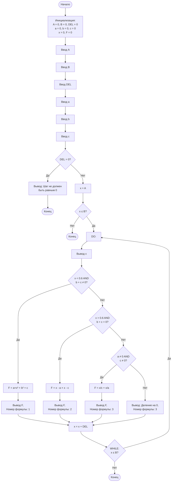

# Блок-схема программы с циклом DO-WHILE

## Как визуализировать:
1. Скопируйте код выше
2. Откройте https://mermaid.live/
3. Вставьте код в редактор
4. Экспортируйте в PNG или SVG

## Особенность DO-WHILE:
- Тело цикла выполняется минимум 1 раз
- Условие проверяется ПОСЛЕ выполнения тела цикла
- В коде есть предварительная проверка `if (x <= B)` перед входом в do-while

