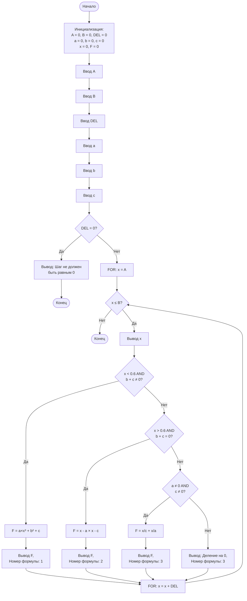

# Блок-схема программы с циклом FOR

## Как визуализировать:
1. Скопируйте код выше
2. Откройте https://mermaid.live/
3. Вставьте код в редактор
4. Экспортируйте в PNG или SVG

## Особенность FOR:
- Инициализация, условие и инкремент объединены в заголовке цикла
- `for (x = A; x <= B; x += DEL)`
- Условие проверяется ДО выполнения тела цикла

