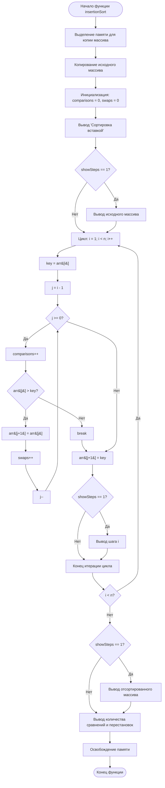

# Блок-схема сортировки вставкой (Insertion Sort)

```mermaid
flowchart TD
    Start([Начало функции insertionSort]) --> Alloc[Выделение памяти для копии массива]
    Alloc --> Copy[Копирование исходного массива]
    Copy --> Init[Инициализация: comparisons = 0, swaps = 0]
    Init --> PrintTitle[Вывод 'Сортировка вставкой']
    PrintTitle --> CheckShow1{showSteps == 1?}
    
    CheckShow1 -->|Да| PrintOriginal[Вывод исходного массива]
    CheckShow1 -->|Нет| LoopStart[Цикл: i = 1; i < n; i++]
    PrintOriginal --> LoopStart
    
    LoopStart --> SetKey[key = arr&#91;i&#93;]
    SetKey --> SetJ[j = i - 1]
    SetJ --> WhileCheck{j >= 0?}
    
    WhileCheck -->|Да| IncComp[comparisons++]
    IncComp --> Compare{arr&#91;j&#93; > key?}
    
    Compare -->|Да| Shift[arr&#91;j+1&#93; = arr&#91;j&#93;]
    Shift --> IncSwap[swaps++]
    IncSwap --> DecJ[j--]
    DecJ --> WhileCheck
    
    Compare -->|Нет| Break[break]
    Break --> Insert[arr&#91;j+1&#93; = key]
    WhileCheck -->|Нет| Insert
    
    Insert --> CheckShow2{showSteps == 1?}
    CheckShow2 -->|Да| PrintStep[Вывод шага i]
    CheckShow2 -->|Нет| LoopEnd[Конец итерации цикла]
    PrintStep --> LoopEnd
    
    LoopEnd --> LoopCheck{i < n?}
    LoopCheck -->|Да| LoopStart
    LoopCheck -->|Нет| CheckShow3{showSteps == 1?}
    
    CheckShow3 -->|Да| PrintSorted[Вывод отсортированного массива]
    CheckShow3 -->|Нет| PrintStats
    PrintSorted --> PrintStats[Вывод количества сравнений и перестановок]
    
    PrintStats --> Free[Освобождение памяти]
    Free --> End([Конец функции])
```

