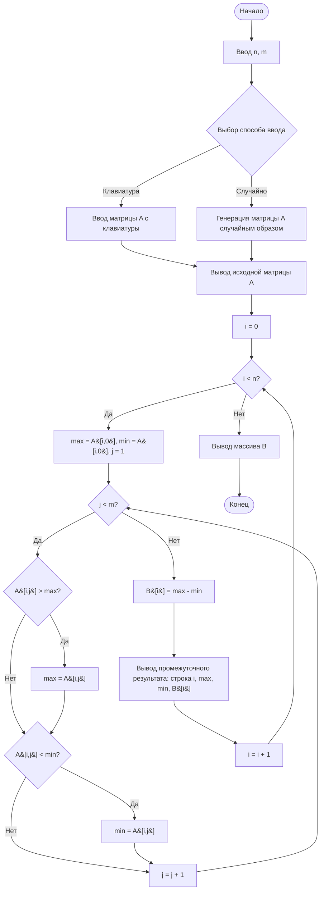

```mermaid
flowchart TD
    Start([Начало]) --> InputNM[Ввод n, m]
    InputNM --> Choice{Выбор способа ввода}
    Choice -->|Клавиатура| InputMatrix[Ввод матрицы A с клавиатуры]
    Choice -->|Случайно| GenerateMatrix[Генерация матрицы A случайным образом]
    InputMatrix --> OutputMatrix[Вывод исходной матрицы A]
    GenerateMatrix --> OutputMatrix
    OutputMatrix --> InitI[i = 0]
    InitI --> CheckI{i < n?}
    CheckI -->|Нет| OutputB[Вывод массива B]
    CheckI -->|Да| InitMaxMin[max = A&#91;i,0&#93;, min = A&#91;i,0&#93;, j = 1]
    InitMaxMin --> CheckJ{j < m?}
    CheckJ -->|Нет| CalcDiff[B&#91;i&#93; = max - min]
    CheckJ -->|Да| CompareMax{A&#91;i,j&#93; > max?}
    CompareMax -->|Да| UpdateMax[max = A&#91;i,j&#93;]
    CompareMax -->|Нет| CompareMin{A&#91;i,j&#93; < min?}
    UpdateMax --> CompareMin
    CompareMin -->|Да| UpdateMin[min = A&#91;i,j&#93;]
    CompareMin -->|Нет| IncJ[j = j + 1]
    UpdateMin --> IncJ
    IncJ --> CheckJ
    CalcDiff --> OutputIntermediate[Вывод промежуточного результата: строка i, max, min, B&#91;i&#93;]
    OutputIntermediate --> IncI[i = i + 1]
    IncI --> CheckI
    OutputB --> End([Конец])
```

